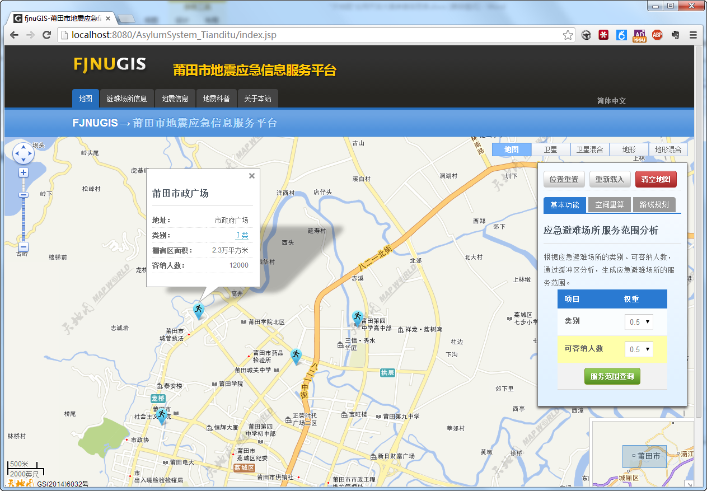
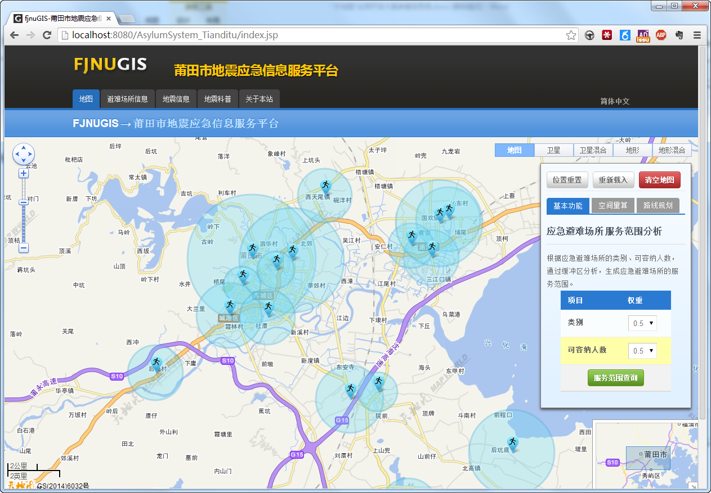
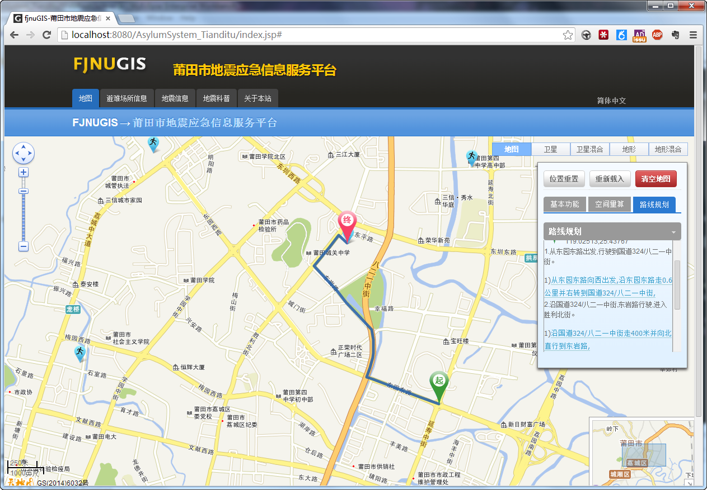
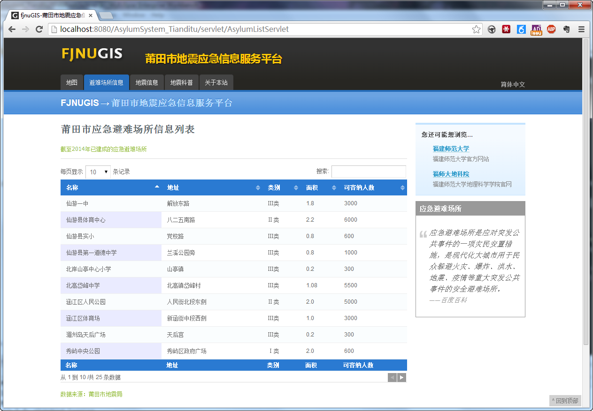
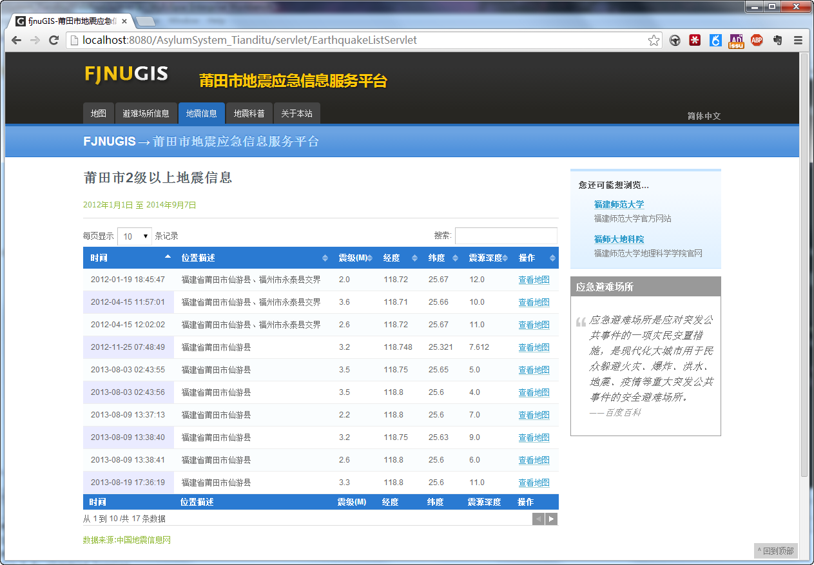
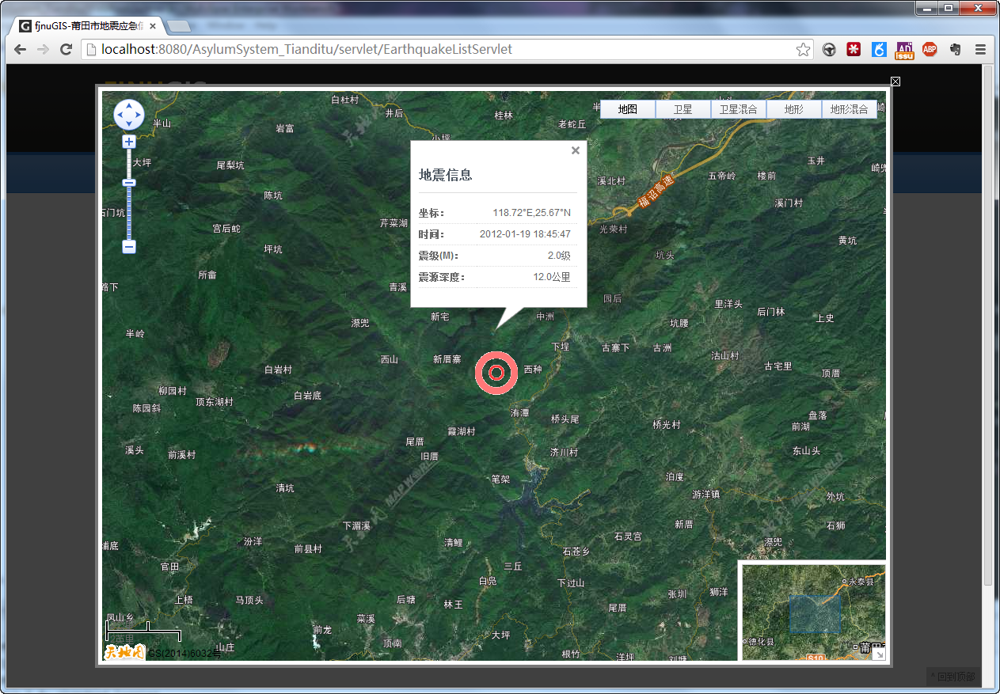
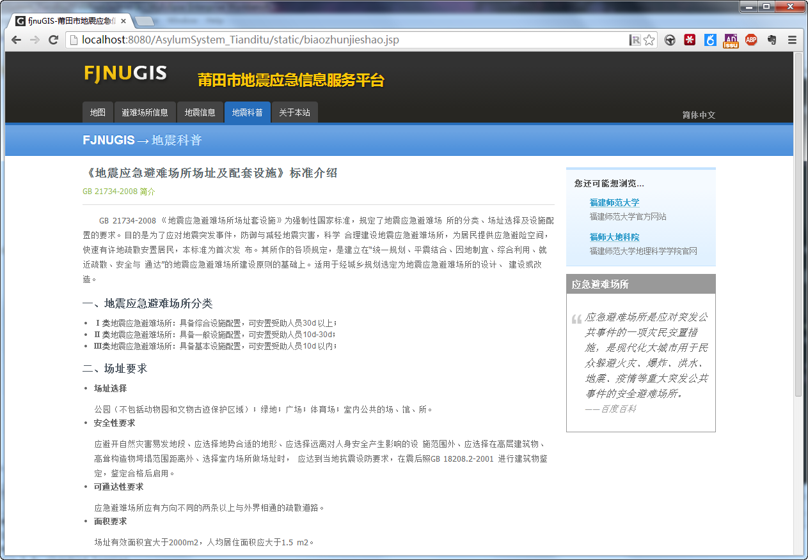

#莆田市应急信息服务平台网站
##简介
使用"天地图"API开发的一个web应用,有幸获取了`第二届"天地图"开发大赛`及`首届"天地图·福建"应用开发大赛`优秀奖. 奖品分别是一个**路由器**(全国赛)和**一千元现金**(省赛). 感谢福建省地理信息中心,奖金真的很给力~ 
##截图
1. 应急避难场所查询与可视化

2. 应急避难场所服务范围查询

3. 路径规划

4. 应急避难场所列表查询

5. 地震信息列表查询

6. 地震信息可视化

7. 地震科普

