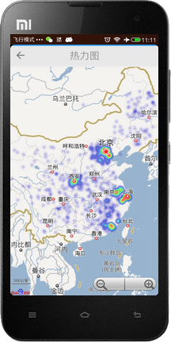

#DangerMarker--基于Android的空间信息分享系统
##简介
大学的毕业设计，一款Android应用（包括前后端），用于查看和分享身边的安全隐患，比如：没有井盖的下水道、外露的电缆等。

* 后端使用经典的`Struts2`+`Spring`+`Hibernate`
* 数据库使用MySQL，用到了MySQL的空间扩展，用于组织和查询空间数据。
* 地图使用了`百度地图SDK`

##截图
###1. 地图界面

###2. 功能菜单

###3. 列表视图
> 按距离排序，显示周围的安全隐患

###4.热力图

###5.标签云

###6.分享信息

###7.离线地图

