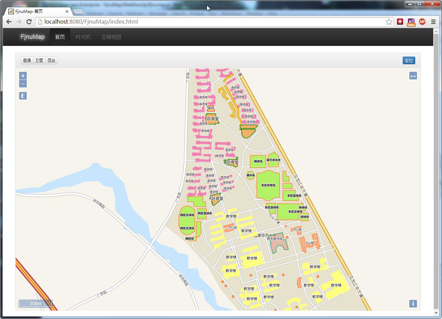
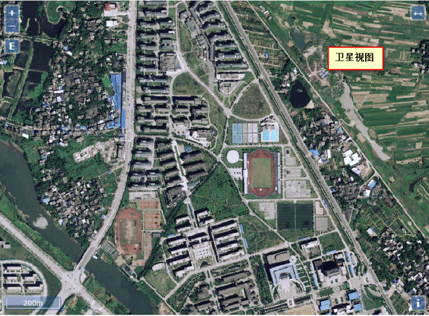
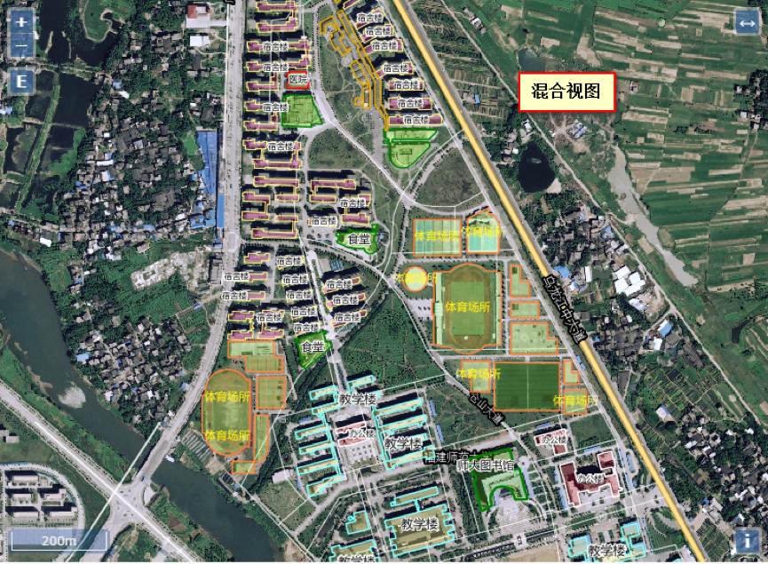
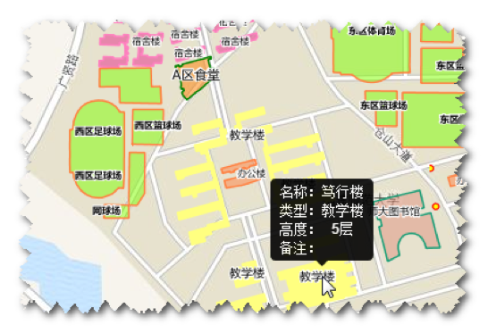
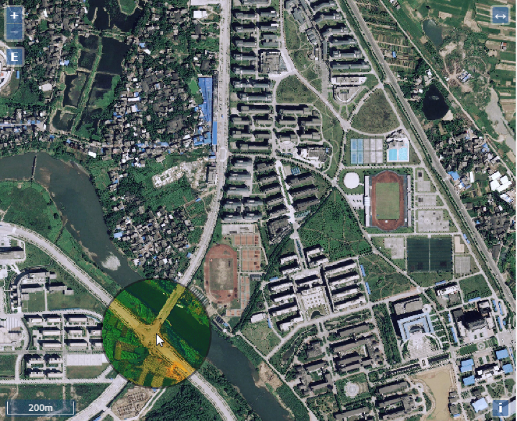
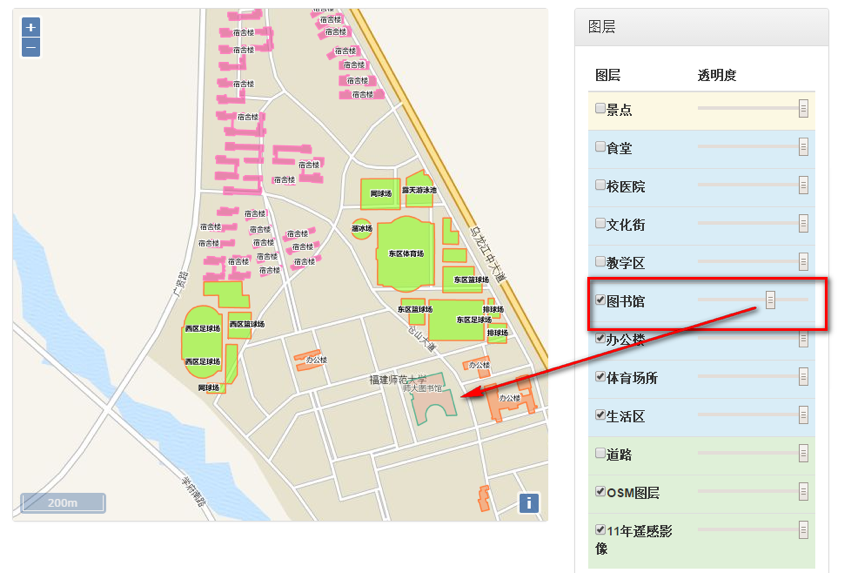
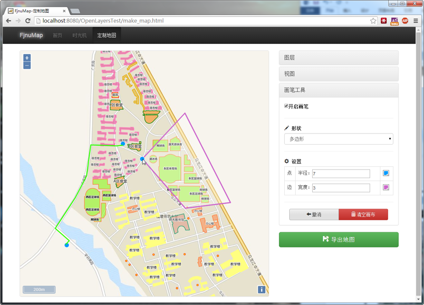

#FjnuMap--福师大校园地图
##简介
'3S'综合实习时的项目，这也是大学期间个人**最喜欢的作品**。从坐标的测量，到遥感图像校正，再到系统开发，这真的是一个非常有意义的体验。

只要用的的工具有：

* 开源GIS服务器`GeoServer`，用于提供地理数据服务。
* 开源地图前端框架`Openlayers 3`
* twitter的响应式前端框架`Bootstrap`

##截图
###1. 校园地图
帮助新生熟悉校园，避免走错教学楼的尴尬。

###2. 信息查询

###3. “时光机”
对比相同空间不同时间下的校园，带你领略沧海桑田。
> 特别说明：下图中圆圈部分内为**2006年**的福师大，圆圈外为**2011年**的福师大。

###4. 定制地图

