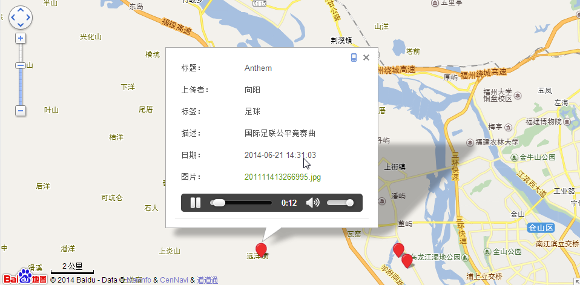
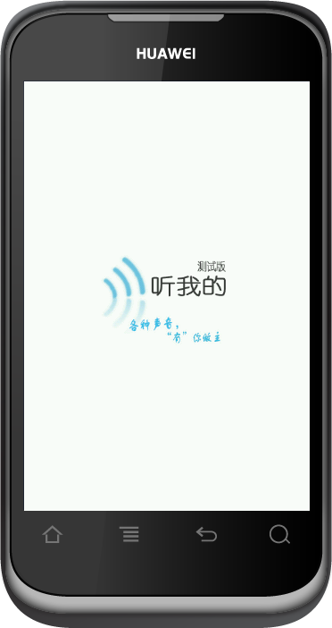
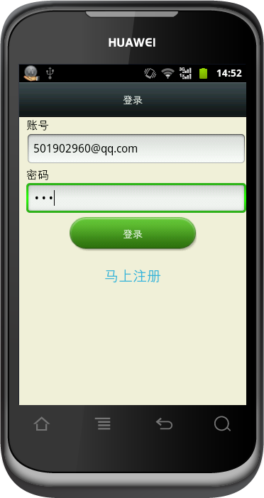

#"听我的"--声音地图
##简介
基于位置的声音信息分享, 用户可以通过该应用将采集到的声音及声音的地理坐标发布出去, 以地图的形式呈现出来.

由于时间不够该项目只完成了一半，但与同学合作的体验是很宝贵的，通过这个项目也学到了不到东西，感谢小伙伴们。

* 后端使用了`Struts2`,`Hibernate`.（因为那是还没学`Spring`。。囧）
* 地图使用了`百度地图SDK`

##截图
###网页端

###手机端

